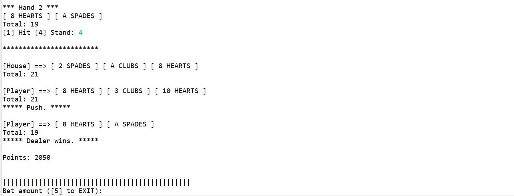

# Blackjack - Java
Author: Luis Carazas

This project simulates Blackjack in a command line interface. The IDE used
was [Eclipse](https://www.eclipse.org/downloads/)

## Walkthrough
 * When the program is ran, the user is instructed to input a bet amount
   * The starting point amount is 2000
   * The user must bet an amount of 100 or more
  *  The program outputs the first cards drawn from both the player and the House
  * Then the user is given choices depending on the cards they drew
    * **Hit** - draw one more card to your hand
    * **Double** - if your starting total is between 9 and 11, double your bet and only draw one more card
    * **Split** - if your first draw has two cards with the same number, you can split them into two hands
    * **Stand** - do not draw more cards and check what the House has

## Screenshots
* On program start, the user must enter a betting amount

* If the user inputs an **invalid bet**

* When the user makes a **valid bet**, the game begins

* When the user chooses **hit**, a new card is added to their hand

* If the user makes an **invalid choice**

* If the user decides to **Double**, they only draw one card

* If the user decides to **Split** their hand, first they play on the first hand

* Then they get to play their second hand. Afterwards the house plays and the program decides the outcome

* If there is an ace present in the hand and a new card drawn would take the value above 21, in case the ace was valued at 11, it gets revalued to 1

* If the user decides to **stand**

* If the House draws a natural (21 on their first hand) and the user does not have one too, the house automatically wins

* If the user has a natural (21) on their first hand and there is a letter card in it, they automatically win if the House does not also have a natural

## Future Upgrades
* [ ] Make the algorithm for Split better
* [ ] When user decides to split, if there is an Ace and a letter card drawn afterwards, they win their exact bet amount and not 1.5x